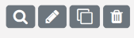

## Table des matières
- [QuizzPi](#QuizzPi)
- [Installation sur un Raspberry 4](#Install)
- [Connexion à l'interface de gestion](#Connexion)
- [Menus de l'interface de gestion](#Menus)
  - [Catégorie-Questions](#Catégorie-Questions)
  - [Banque de questions](#Banque)
    - [Editer une question](#Editer)
    - [Dupliquer une question](#Dupliquer)
    - [Supprimer une question](#Supprimer)
    - [Ajouter une question](#AjoutQuestion)
  - [Catégorie-Quizz](#CatQuizz)
  - [Quizz](#Quizz)
    - [Editer un Quizz](#EditerQuizz)
    - [Dupliquer un Quizz](#DupliquerQuizz)
    - [Supprimer un Quizz](#SupprimerQuizz)
    - [Ajouter un Quizz](#AjoutQuizz)
  - [Etudiants](#Etudiants)
- [Questions aléatoires](#Alea)
- [Démarrer un Quizz](#StartQuizz)
- [Tutoriel](#Tutoriel)

## QuizzPi

Environnement de développement de quizz interactifs sur Raspberry

L'objectif de ce projet et de proposer un environnement autonome s'exécutant sur un Raspberry et permettant à un enseignant d'organiser un quizz interactif avec ses étudiants.

Les questions peuvent intégrées des données aléatoires générées à partir d'un script Python. De même la vérification de la réponse peut être effectué à partir d'un script Python.

QuizzPi autorise la gestion de 2 types de question :

- simple : la réponse est une chaîne de caractères saisie par l'utilisateur,
- multiple : la réponse est choisie en cliquant parmi un ensemble de réponses proposées.

## Installation sur un Raspberry 4

## Connexion à l'interface de gestion

Pour se connecter à l'interface de QuizzPi, il suffit de lancer un navigateur et de saisir l'adresse :

http://192.168.3.14/quizzpi

afin d'obtenir la page d'accueil du site

Via le menu **"Se Connecter"**, l'enseignant entre son login et son mot de passe.

Une fois identifié, il accède à l'interface de gestion 

## Menus de l'interface de gestion

### Catégorie-Questions

Ce menu permet de créer des catégories afin d'y classer les questions. Pour chaque catégorie créée, le nombre de questions présentes dans cette dernière est indiqué entre parenthèses.

L'ajout d'une catégorie via  le bouton **+Ajouter** consiste à spécifier le nom de la nouvelle catégorie et à sélectionner sa catégorie parente.

### Banque de questions

C'est à partir de ce menu que l'on peut lister les questions disponibles, ajouter de nouvelles questions, modifier les questions existantes ou en supprimer certaines.

L'option *Choisir une catégorie* permet de n'afficher que les questions de la catégorie sélectionnée. 

La zone de saisie pour la *sélection de filtres* permet de faire une recherche de certaines questions en spécifiant des critères de sélection.

En cliquant sur l'énoncé d'une question, on a un aperçu rapide de son contenu (à ce niveau là pas d'interprétation des graphiques s'il y en a, et pas d'interprétation des variables aléatoires).

Pour chaque question affichée, un ensemble d'action est possible via la barre d'icones

 

Les actions disponibles sont (de gauche à droite):

- **Aperçu de la question** : en cliquant sur la loupe, un aperçu de la question tel quelle sera présentée à l'utilisateur final est affichée. Si l'énoncé initial de la question contient des données aléatoires, chaque click sur l'aperçu de la question affiche un énoncé différent.

  Dans la fenêtre d'aperçu, vous pouvez tester votre question en soumettant une réponse (pour l'exemple ci-dessus, en cliquant sur les choix disponibles). Ceci aura pour effet de faire apparaître le bouton **Vérifier Réponse** qui permettra de contrôler la validité de votre réponse en cliquant dessus. 
  

  

- **Editer une question** : en cliquant sur le crayon, on accède à l'interface permettant d'éditer les différents paramètres d'une question (voir le paragraphe [Ajouter une question](#AjoutQuestion)).
  

- **Dupliquer une question** : en cliquant sur l'icone représentant deux rectangles superposés, on créé une copie de la question actuelle dans la banque de questions.
  

- **Supprimer une question** : en cliquant sur l'icone de la poubelle, la question sera supprimer. Pour supprimer un ensemble de questions, il suffit de les sélectionner en cliquant sur la case à cocher située à côté du titre de la question, puis de cliquer sur le bouton **Supprimer** situé en bas de page. 
  *Remarque : en cliquant sur la case à cocher située à coté de l'intitulé **Titre** située dans la première ligne de la banque de questions, on séléctionne l'ensemble des questions de la catégorie courante.*
  
  
- **Ajouter une question** : afin de créer une nouvelle question, il suffit de cliquer sur le bouton **Ajouter**. Les différentes informations à fournir pour élaborer une question sont :
  
  - *Titre* : le titre de la question
  
  - *Catégorie* : le nom de la catégorie dans laquelle ranger la question
  
  - *Type* : permet de préciser si la  question est de type simple ou multiple. Par défaut, le type simple est sélectionné. En sélectionnant le type multiple, de nouveaux champs apparaissent permettant de :
    -  préciser si lors de la visualisation de la question, les différents choix possibles doivent être mélangés aléatoirement ou non,
    - proposer jusqu'à 8 choix possibles de réponse.
      
    
  - Points : le nombre de points attribués à la question (non utilisé dans la version actuelle de QuizzPi)
  
  - Enoncé : l'énoncé de la question. Cette énoncé peut contenir du code TeX. Le menu **TeX** permet de prévisualiser le résultat. Il suffit pour cela de sélectionner le code à interpréter et de cliquer sur le menu **TeX**.
  
    
    Du code Python peut être inséré dans un énoncé en cliquant sur l'icone **{;}**. Ceci ouvre une fenêtre permettant de saisir le code Python. Attention, à ce niveau là il n'y a aucune coloration syntaxique. Une fois le code saisi, cliquez sur **Enregistrer** et le code Python apparaîtra dans l'énoncé dans une boite grisée et une coloration syntaxique est appliquée.
  
    
  
  - Langage : permet de sélectionner le langage qui sera utilisé pour écrire le script de génération des données aléatoires (Python ou SageMath). Seul Python est géré par la version actuelle de QuizzPi.
  
  - Réponse : champ contenant la réponse attendue. Ce champ est aussi utilisé pour afficher la réponse aux étudiants lors du déroulement du quizz.
  
  - Vérification : script Python permettant de vérifier la réponse de l'étudiant. Si ce champ est vide, la réponse de l'étudiant est comparée avec la valeur présente dans le champ *Réponse*. Dans le cas contraire, le concepteur de la question peut utiliser dans le script de vérification la variable prédéfinie reponse_etudiant pour récupérer la réponse de l'étudiant. Dans l'exemple ci-dessous, la réponse correcte est *s=s+i*. Pour éviter de ne pas prendre en compte des réponses du type *s = s + i*  ou *s=   s+i*, on écrit un script de vérification afin de filtrer les espaces présents dans la réponse de l'étudiant.
    
  

### Catégorie-Quizz

Ce menu permet de créer des catégories afin d'y classer les quizz. Pour chaque catégorie créée, le nombre de quizz présents dans cette dernière est indiqué entre parenthèses.

### Quizz

C'est à partir de ce menu que l'on peut lister les quizz disponibles, ajouter de nouveaux quizz,  modifier les quizz existants ou en supprimer certains.
L'option *Choisir une catégorie* permet de n'afficher que les quizz de la catégorie sélectionnée. 

Pour chaque question affichée, un ensemble d'action est possible via la barre d'icones

 

Les actions disponibles sont (de gauche à droite):

- **Lancer un quizz** : cette icone permet de démarrer un quizz lors d'une séance avec les étudiants (cf. paragraphe [Démarrer un quizz](#StartQuizz)).
  

- **Editer un quizz** : en cliquant sur l'icone du crayon, on accède à l'interface permettant d'éditer les différents paramètres d'un quizz (voir le paragraphe [Ajouter un quizz](#AjoutQuizz)).
  

- **Dupliquer un quizz** : en cliquant sur l'icone représentant deux rectangles superposés, on créé une copie du quizz actuel.
  

- **Supprimer un quizz** : en cliquant sur l'icone de la poubelle, le quizz sera supprimée. Pour supprimer un ensemble de quizz, il suffit de les sélectionner en cliquant sur la case à cocher située à côté du titre du quizz, puis de cliquer sur le bouton **Supprimer** situé en bas de page. 
  *Remarque : en cliquant sur la case à cocher située à coté de l'intitulé **Titre** située dans la première ligne de la liste des quizz, on séléctionne l'ensemble des quizz de la catégorie courante.*

- **Ajouter un quizz** : afin de créer un nouveau quizz, il suffit de cliquer sur le bouton **Ajouter**. Les différentes informations à fournir pour élaborer un quizz sont :

  - *Titre* : le titre du quizz
  - *Catégorie* : le nom de la catégorie dans laquelle ranger le quizz
  - *Indicateur de mélange de questions* : une option permettant d'indiquer si à chaque lancement du quizz, les questions doivent être présentées ou non dans un ordre aléatoire.

  

  Une fois ces informations fournies, en cliquant sur le bouton **Sauvegarder**, un nouveau bouton apparaît, permettant de rajouter des questions au quizz.

  

  En cliquant sur le bouton **Ajouter Questions**, une fenêtre apparaît avec la liste des questions sauvegardées dans la banque de questions. Cette liste peut être filtrée en sélectionnant une catégorie de questions. Chaque question peut être prévisualisée en cliquant sur l'icone de la loupe. Pour sélectionner les questions à rajouter au quizz, il suffit de cliquer sur la case à cocher située à gauche du titre de la question. On peut sélectionner l'ensemble des questions en cliquant sur la case à cocher située à côté de l'intitulé **Titre**.

  

  Une fois la sélection des questions effectuées, il suffit de cliquer sur le bouton **Ajouter** afin de la ajouter au quizz. On revient alors à la fenêtre d'édition du quizz où apparaissent les questions sélectionnées.

  

  A partir de cette liste on peut :

  - prévisualisation une question en cliquant sur l'icone de la loupe

  - afficher le texte brut de l'énoncé d'une question en cliquant dans la zone de l'énoncé (les variables aléatoires ne sont pas interprétées)

  - supprimer une ou plusieurs questions en sélectionnant les cases à cocher présentes à côté du titre des questions puis en cliquant sur le bouton **Supprimer du quizz la sélection**. Toutes les questions peuvent être sélectionnées en cliquant sur la case à cocher située en première ligne de la liste à côté de l'intitulé **Titre**.

     

  - déplacer des questions pour qu'elles s'affichent dans un ordre précis lors du démarrage du quizz dans le cas où l'option Mélanger les questions a été désactivé. Pour déplacer une question il suffit de cliquer sur le titre et tout en maintenant le bouton enfoncé de déplacer la questions à la position voulue et de relacher le bouton de la souris.

     

### Etudiants

Ce menu permet d'indiquer quels sont les étudiants qui pourront se connecter pour effectuer un quizz.

Pour ajouter un étudiant à la liste des étudiants pouvant se connecter à QuizzPi, il suffit de cliquer sur l'icone **+** et de fournir les renseignements suivants :

- Nom,
- Prénom,
- Courriel (il servira d'identifiant à l'étudiant pour se connecter à l'interface de saisie des réponses lors du déroulement du quizz),
- Filière.

Il est possible d'importer directement une liste d'étudiants si cette dernière est au format CSV. L'importation se fait en cliquant sur le bouton **Parcourir**. Le format du fichier doit être le suivant :

<i>Nom,Prenom,Courriel,Filiere</i>

## Questions aléatoires

Afin de générer des questions dépendant de données aléatoires, il suffit de sélectionner **Python** dans le champ **Langage** du formulaire de création d'une question. Ceci fait apparaître un nouveau champ intitulé **Script** dans lequel l'utilisateur pourra générer des variables qui pourront être utilisées dans l'énoncé de la question ainsi que dans le champ **Reponse** et les différents champs de Choix dans le cas d'une question à choix multiple. 

**Attention** : dans les champs **Enoncé**, **Reponse** ou les champs **Choix**, on ne peut utiliser qu'une variable définie dans le script, on ne peut pas utiliser une instruction Python.

Dans le script Python, le nom des variables destinées à être utilisées dans les champs **Enoncé** , **Reponse**  ou **Choix** doit commencer par **__**.  

Dans les champs **Enoncé**, **Reponse** ou **Choix**, afin d'utiliser une variable définie dans le script, on utilise la syntaxe **{{__nom-variable}}**.

Dans l'exemple ci-dessous, on créé une question qui demande à l'étudiant de calculer le pgcd de 2 entiers. Les 2 entiers sont générés aléatoirement  grâce à un script Python et la bonne réponse est aussi calculée par le script.

On utilise alors les 2 variables \_\_val1 et \__val2 dans l'énoncé.

## Démarrer un Quizz

Une fois le Raspberry Pi relié à un vidéoprojecteur, l'enseignant se connecte à son interface gestion et accède au menu Quizz. L'affichage de son navigateur est vidéoprojeté et visible par l'ensemble des étudiants. 

En cliquant sur l'icone  associé à un quizz, une nouvelle fenêtre s'ouvre permettant aux étudiants de scanner à partir de leur téléphone portable un QR code pour accéder à l'interface à partir de laquelle ils pourront soumettre leurs réponses. Si les étudiants ne disposent pas de lecteur de QR code, l'adresse du site où ils doivent se connecter à partir du navigateur présent sur leur téléphone est aussi affiché. 

Une fois cette adresse saisie, ou le QR code lu, les étudiants accèdent sur leur téléphone à une interface de connexion :

 L'enseignant peut voir au fur et à mesure le nombre d'étudiants connectés (indication en dessous de la barre de titre).

Tant que l'enseignant n'a pas cliqué sur le bouton **Commencer** pour lancer le quizz, les étudiants ont un message d'attente sur leur téléphone. 

Une fois que l'enseignant aura lancé le quizz, ils pourront accéder à l'interface permettant de répondre aux questions en cliquant sur la flèche droite .

Lorsque l'enseignant lance le démarrage du quizz, la première question s'affiche sur l'écran de projection :

L'enseignant peut voir le nombre total d'étudiants qui se sont inscrits et le nombre d'étudiants qui ont répondu à la questions (compteur **nb reponses/nb etudiants** inscrits présent à gauche du numéro de la question).

Pour répondre à la question en cours, les étudiants ont accès sur leur téléphone à l'interface suivante (dans le cas d'une question à choix multiple) :

Ils n'ont qu'à cliquer sur les choix qui leur semblent être corrects (ici les boutons en jaune sont les choix effectués par l'étudiant). Une fois ses choix effectués, l'étudiant clique sur le bouton Envoyer, un message lui indique alors que sa réponse a été bien reçu et un bouton  apparaît lui permettant de passer à la question suivante.

Si l'étudiant clique sur  avant que l'enseignant ne soit passé à la question suivante, il recevra sur son téléphone un message d'attente.

Lorsque tous les étudiants ont répondu à la question courante, l'enseignant peut afficher la bonne réponse en cliquant sur le bouton **Voir bonne réponse**.

Un bouton **Résultats** apparaît, celui-ci permet à l'enseignant d'afficher des statistiques sur les réponses effectuées. Ci-dessous, on voit que :

- 1/3 des étudiants ont fourni une bonne réponse,
- 1/3 des étudiants ont fourni une mauvaise réponse ou n'ont pas répondu à la question,
- 1/3 des étudiants ont fourni une réponse incomplète. Ce type de réponse correspond uniquement aux questions à choix multiple. Une réponse est considérée comme incomplète si c'est un sous-ensemble de la réponse.

Dans le cas d'une question de type simple, où l'étudiant doit saisir manuellement la réponse, l'interface proposée à l'étudiant est la suivante :

Une fois le quizz terminé, l'étudiant obtient sur son téléphone des statistiques sur les réponses effectuées et un émoji symbolise son résultat au quizz :

|  |  |  |
| ----------------------------------------------------- | ----------------------------------------------------- | ----------------------------------------------------- |

correspond au nombre de bonnes réponses sur le nombre total de questions.

correspond au nombre de mauvaises réponses sur le nombre total de questions.

correspond au nombre de  réponses incomplètes sur le nombre total de questions. Les réponses incomplètes ne concernent que les questions à choix multiple. Une réponse est considérée comme incomplète si elle constitue  un sous-ensemble de la réponse totale.

correspond au nombre de questions où l'étudiant n'a pas répondu sur le nombre total de questions. En effet dans l'interface proposé à l'étudiant, ce dernier peut très bien décider de ne pas répondre en cliquant directement sur le bouton **Envoyer**.

## Tutoriel

 Afin de découvrir les différentes fonctionnalités de QuizzPi, la catégorie Tutoriel de la Banque de questions, comporte un ensemble de 17 questions essayant de couvrir l'ensemble des fonctionnalités de Quizzpi notamment en ce qui concerne la gestion des données aléatoires et la vérification par un script Python de la réponse de l'utilisateur.

## TODO

- [ ] Intégrer totalement SageMath.
- [ ] Dans l'interface étudiant de réponse à une question simple, restreindre les possibilités de saisie de l'étudiant afin d'éviter les problèmes d'interprétation de Python. Par exemple si la réponse doit être de type numérique, ne proposer que l'accès à un clavier numérique. De même si la réponse doit être une chaîne de caractères, proposer l'accès à un sous-ensemble du clavier.
- [ ] Améliorer l'interface utilisateur.
- [ ] Prévoir l'import JSON pour la banque de questions et les quizz.
- [ ] Gérer les points affectés à une question.

